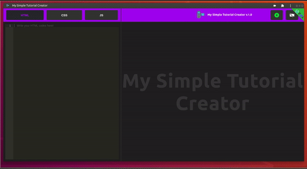
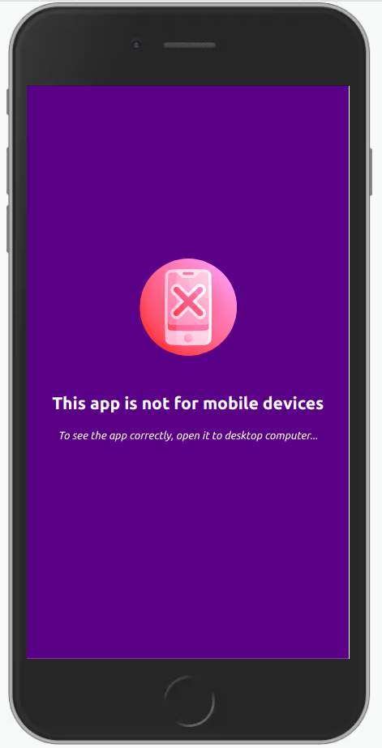

# User Guide

---

## My Simple Tutorial Creator_V1.0.0

It is a Progressive Web App (cross-platform).

You can easily install this application on a Windows, Mac or Linux computer.

## :computer: Online sites

**You can use My Simple Tutorial Creator for FREE** **[here](https://my-simple-tutorial-creator.netlify.app)**.

### :bookmark: This application is a "mini video tutorial recording studio" with a built-in code editor... but not only, you can capture the screen, window or browser tab you want, so you can use your usual editor without any worries*!

---

>**:heavy_check_mark: This is Progressive Web App (PWA)**

You can easily install this application on a Windows, Mac or Linux computer.

---

## :heavy_exclamation_mark: Important Info:
>The built-in Cam only works on the application's native code editor - to record a screen or window other than the one in the application, use the "My Simple Cam* " widget designed for this purpose.

*** *This widget installs directly on MacOs/Linux/Windows computers, there is no web version, it is a desktop version only.***

---
##

---

**:heavy_exclamation_mark:**

>

---

**:heavy_exclamation_mark: **

>

---

**:heavy_exclamation_mark: **

>

---

**:x:** this application is  not responsive on mobile :mobile_phone_off: (as it is an application for people working in front of a computer - developer like me for example - I did not find useful to do media queries for that).

---
Can I use Compatibility:

## :bust_in_silhouette: Author

- Thought, designed and developed with :purple_heart: by Rodolphe Augusto

---

## :large_blue_diamond: A few words from the author

Enjoy the World :smirk:

**:memo: To Do for the next version:**

>:bar_chart: Add csv export.

---

## :sparkling_heart: Support the project

I put almost everything open-source I can, and try to accommodate anyone who needs help using these projects. Obviously,
this takes time. You can use this service for free.

However, if you are using this project and are happy with it or just want to encourage me to keep creating: -

- Put a star and share the project :rocket:

Thank you! :heart:

---

## :scroll: License

MIT

---

