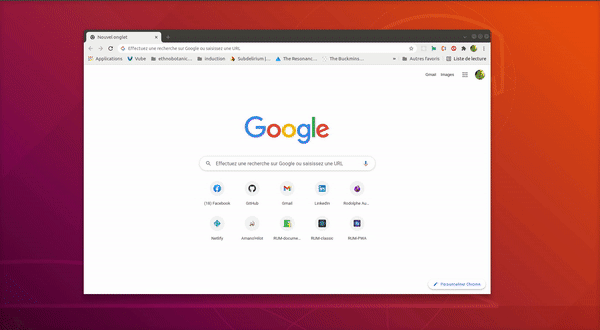
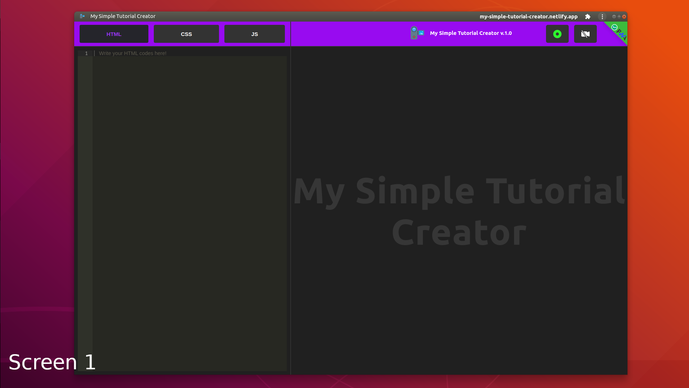

[](https://github.com/rodolphe37/my-simple-tutorial-creator/blob/main/LICENSE)
[](https://github.com/rodolphe37/my-simple-tutorial-creator/graphs/commit-activity)
[](https://www.javascript.com/)
[](https://github.com/rodolphe37/my-simple-tutorial-creator/issues)
[](https://open.vscode.dev/rodolphe37/my-simple-tutorial-creator)
[](https://github.com/Naereen/badges/)


[](https://rodolphe-augusto.fr)
[](https://app.netlify.com/sites/mystifying-hugle-40a501/deploys)

# User Guide

---

## My Simple Tutorial Creator_V1.0.0

---

## :computer: Online sites

**You can use My Simple Tutorial Creator for FREE** **[here](https://my-simple-tutorial-creator.netlify.app)**.

---

### :bookmark: This application is a "mini video tutorial recording studio" with a built-in code editor (html/css/js)... but not only, you can capture the screen, window or browser tab you want, so you can use your usual editor without any worries*!


---


>**:heavy_check_mark: This is Progressive Web App (PWA)**

You can easily install this application on a Windows, Mac or Linux computer.



---


## :heavy_exclamation_mark: Important Info:
>The built-in Cam only works on the application's native code editor - to record a screen or window with Cam option other than the one in the application, use the **"My Simple Cam**"* widget designed for this purpose.

***[*This widget](https://github.com/rodolphe37/my-simple-cam-dektop-app) installs directly on MacOs/Linux/Windows computers, there is no web version, it is a desktop version only.***

---


# How to select screen, window or browser tab


**:heavy_exclamation_mark: Select the screen you want to record!**


---


**:heavy_exclamation_mark: Select the window you want to record!**


---

**:heavy_exclamation_mark: Select the browser tab you want to record!**


---


## The native code editor!

**:heavy_exclamation_mark: You can work directly in the editor, any changes are taken into account instantly.**


---

**:heavy_exclamation_mark: You can record your video directly, and then once it is finished, you can download it in .mp4 format.**

>


---

## Other code editor!

###  **You need to install "my Simple Cam" widget before**

>The link for download the widget for your operating system [here](https://github.com/rodolphe37/my-simple-cam-dektop-app)

**:heavy_exclamation_mark: How to record my usual code editor with My Simple Tutorial Creator & the My simple Cam widget?**

>


---

**:heavy_exclamation_mark: Start the application installed on the computer (or the web version)**


---

**:heavy_exclamation_mark: Put the application window on the screen you want...**





---

**:heavy_exclamation_mark: Now start the My Simple Cam widget**


---

**:heavy_exclamation_mark: Place the widget where you want**

>Place the widget where you want it,


>then start the widget cam.


>And the button to start recording.


---

**:heavy_exclamation_mark: Start recording movie with sound**

>On the app there is a green button, this button allows you to choose to capture the screen you want. click it!


---

**:heavy_exclamation_mark: Choose the screen**

>Click on the thumbnail of the screen you wish to capture.


---

**:heavy_exclamation_mark: When recording is in progress...**

>A message appears at the bottom of the relevant window.


>Click on the red button to stop the audio/video recording.


---

**:heavy_exclamation_mark: Download the video!**

>When the recording is complete, a button to download the video appears.


---

**:heavy_exclamation_mark: Your video is ready now!...**


---

## :heavy_exclamation_mark: How to unistall the app.

>If you want to uninstall the application from your computer, nothing could be easier!
>
>Just start the application.


---


---


## You want deploy your own version

>Fork or clone directly this repository.

### Install the dependencies

```
yarn
```
or

```
npm i
```
### Start the App

```
yarn start

```
or

```
npm start

```
### Build & deploy

```
yarn build

```

or

```
npm build
```

>Use github, netlify, vercel, etc... for the deployment!

---

### **:x:** this application is  not responsive on mobile :mobile_phone_off: (as it is an application for people working in front of a computer - developer like me for example - I did not find useful to do media queries for that).


---


## :bust_in_silhouette: Author

- Thought, designed and developed with :purple_heart: by Rodolphe Augusto

---

## :large_blue_diamond: A few words from the author

Enjoy the World :smirk:

---

## :sparkling_heart: Support the project

I put almost everything open-source I can, and try to accommodate anyone who needs help using these projects. Obviously,
this takes time. You can use this service for free.

However, if you are using this project and are happy with it or just want to encourage me to keep creating: -

- Put a star and share the project :rocket:

Thank you! :heart:

---

## :scroll: License

MIT

---

## My other projects:

>### My Simple Task Manager
>https://github.com/rodolphe37/my-simple-tasks-manager-

>### My Simple Cam
>https://github.com/rodolphe37/my-simple-cam-dektop-app

>### QRCode Tools
>https://github.com/rodolphe37/qr-code-tools

>### App for decrypt greenPass europe QRcode
>https://github.com/rodolphe37/qrcode-decoder

>### Css animation with Create React App base.
>https://github.com/rodolphe37/halloween2021-bat-tuto-youtube-video

>### My GitHub "open Sources" project
>https://github.com/rodolphe37/pwa-react-project

>### cra-template-github-my-profile
>https://github.com/rodolphe37/cra-template-github-my-profile

>### My Awesome Custom Alert
>https://github.com/rodolphe37/my-awesome-custom-alert

>### Geolocation starter app React-native
>https://github.com/rodolphe37/react-native_geolocation-tracker

>### Classic React Ultimate Messenger version repository (for open sources contributors)
>https://github.com/rodolphe37/rum-open-sources

>### React Ultimate Messenger template for React (create-react-app tools)
>https://github.com/rodolphe37/cra-react-ultimate-messenger

>### PWA React Ultimate Messenger template for React (create-react-app tools)
>https://github.com/rodolphe37/cra-pwa-react-ultimate-messenger

>### installation and initialization shell script for the PWA React Ultimate Messenger template
>https://github.com/rodolphe37/pwa-rum-install-pack

>### Upload-image-profil-component
>https://github.com/rodolphe37/Upload-image-profil-component

>### Jeux libres de droits "open Sources" - Memory Yoga Cards Game - Sort the Waste Game - Match 3 Yoga Game - Tetris Classic Game - Remake Earth Puzzle Game
>https://github.com/rodolphe37/install-games-repository

>### Administration template - React JS & react-admin
>https://github.com/rodolphe37/nfc-updates-front


>### Administration template Backend - Node & Express
>https://github.com/rodolphe37/nfc-updates-back

---
